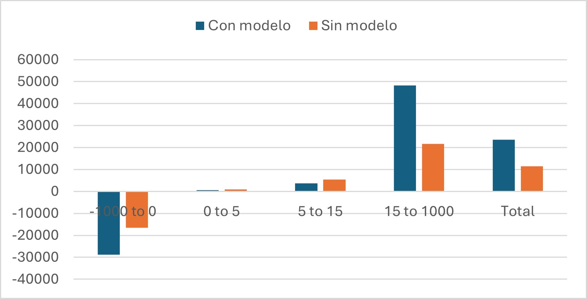
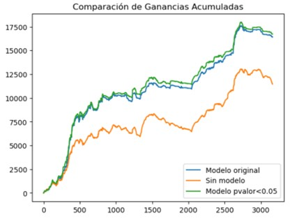
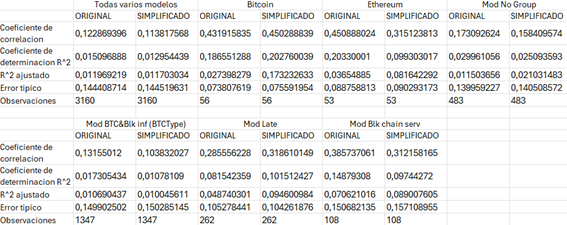

# 📊 Cryptocurrency Investment Analysis with Machine Learning

## 📖 Project Description
The primary goal of this project is to predict the price movements of various cryptocurrencies. Historical data from 2020 to 2024, including 10 explanatory variables calculated to aid in predicting the target variable "profit," are provided in the Excel file (`trades_with_features_juego_V3.xlsx`). A linear regression model was selected for three main reasons:

1. **Easy interpretation** for potential investors.
2. **Computationally efficient**.
3. **Lower risk of overfitting**.

However, to thoroughly assess model effectiveness, it would be beneficial to compare results with other machine learning techniques such as decision trees or neural networks.

The Excel file compares fixed investments (always investing €100 per trade) with variable investments. Variable investments depend on profit estimation:
- Below a certain threshold: No investment.
- Between thresholds: €100 investment.
- Above a higher threshold: €200 investment.

This dynamic model allows reduced investments when predicted profits are low and increased investments when profits are high, significantly improving returns and reducing risk.

Analyses were conducted on the entire dataset (tab "Todas varios modelos"), individual cryptocurrencies, and crypto groupings ("narratives"). The results, along with a detailed explanation of each variable and calculation methods, have been documented comprehensively in a LaTeX report.

## 📈 Results
Considering both investment amounts and returns, the model consistently produced higher profits with lower investments compared to fixed investment strategies. Specifically, across all cryptocurrencies:
- **Investment reduced by 16%** (compared to fixed investments)
- **Profit increased by 43%**

Profit-to-investment ratios typically ranged from 6-7%, with a maximum net gain of **8.64%** using the model, compared to only **5.59%** without the model.

  


The above charts illustrate:
- Lower investments in scenarios predicting low or negative profits.
- Comparative performance between the original model, simplified model (removing non-significant variables), and fixed investments. Minimal differences were observed for large datasets, emphasizing model robustness.

Statistical analyses indicate better metrics (higher correlation coefficients, R², adjusted R², and lower errors) for single cryptocurrencies compared to grouped narratives or the complete dataset.



## 🧑‍💻 Conclusions
The analysis confirms that the linear regression model effectively predicts cryptocurrency profits across various scenarios. Key conclusions include:

- Linear regression is broadly applicable for profit estimation in cryptocurrency trading.
- Variable reduction is beneficial mainly for large datasets, simplifying the model without significantly affecting accuracy.
- Different explanatory variables affect each cryptocurrency uniquely:
  1. Variable coefficients vary significantly across cryptocurrencies.
  2. Single-cryptocurrency models provide superior statistics.
  3. Different variables are identified as non-significant in different scenarios.

## 🚀 Next Steps
Future enhancements for professional refinement include:

1. **Expand references**: Integrate more scholarly articles on cryptocurrencies and algorithmic trading.
2. **Improve visualizations**: Clarify chart axes and descriptions. Consider recreating graphs with tools like TikZ for enhanced quality.
3. **Model comparison**: Evaluate decision trees, neural networks, or time series models to validate the performance of linear regression.
4. **Statistical testing**: Use hypothesis testing to statistically validate differences in returns between the model-driven and fixed investment strategies.

## 📂 Project Structure
```
│── IMAGENES                                                 # Visualizations and graphs
│── 3Modelos.ipynb                                           # Analysis and modeling notebook
│── Análisis de inversiones en criptomonedas.tex             # LaTeX report
│── Análisis_de_inversiones_en_criptomonedas_2020_2024.pdf   # Final PDF article
│── Datos_estadísticos.xlsx                                  # Statistical analysis data
│── trades_with_features_juego_V3.xlsx                       # Raw data with features
│── Referencias.docx                                         # Additional research references
│── README.md                                                # This documentation
```

## 🛠 Requirements and Dependencies
Ensure the following Python packages are installed to replicate analyses:

```bash
pip install pandas numpy matplotlib scikit-learn jupyter
```

## 🚀 Getting Started
- **Explore the data**: Open `trades_with_features_juego_V3.xlsx`.
- **Run analyses**: Execute `3Modelos.ipynb` in Jupyter Notebook for modeling, variable selection, and statistical assessments.
- **Statistical insights**: Refer to `Datos_estadísticos.xlsx` for detailed results.
- **Review the report**: Access the LaTeX article (`Análisis de inversiones en criptomonedas.tex`) and its PDF version (`Análisis_de_inversiones_en_criptomonedas_2020_2024.pdf`).

## 📊 Data Sources
- `trades_with_features_juego_V3.xlsx`: Transaction data and derived features.
- `Datos_estadísticos.xlsx`: Summarized statistical results.

## 📸 Visualizations
All images used are located in the `images` folder, ordered sequentially as referenced in the report.

## 🏆 Authors
**Mikel Izkue Urdaniz**
**Francisco Hernando Gallego**
